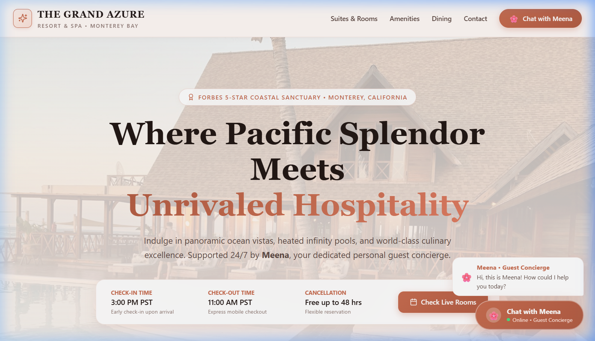
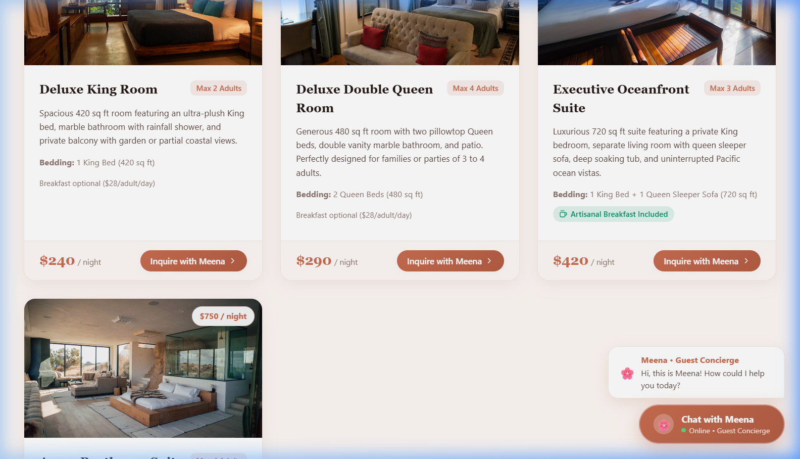
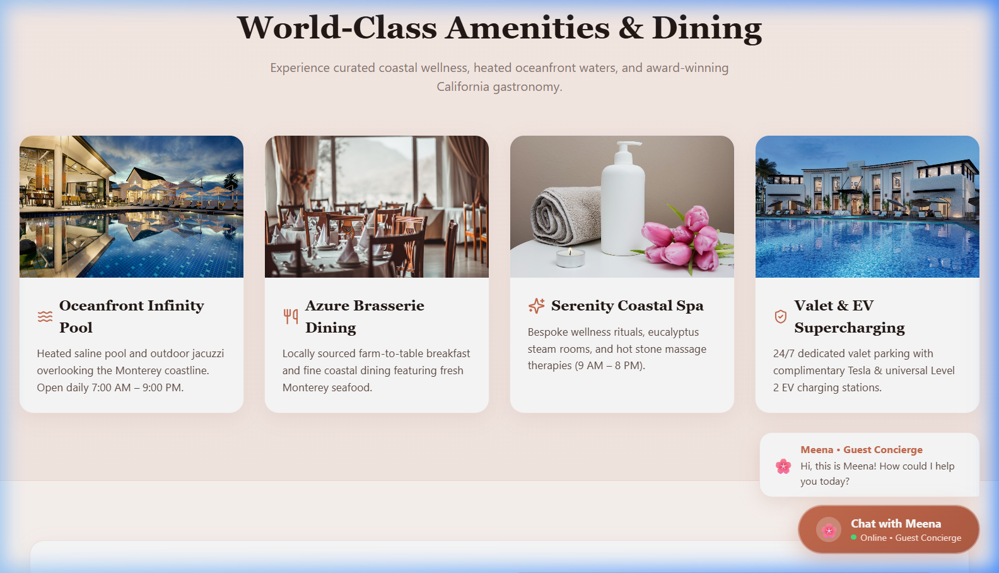
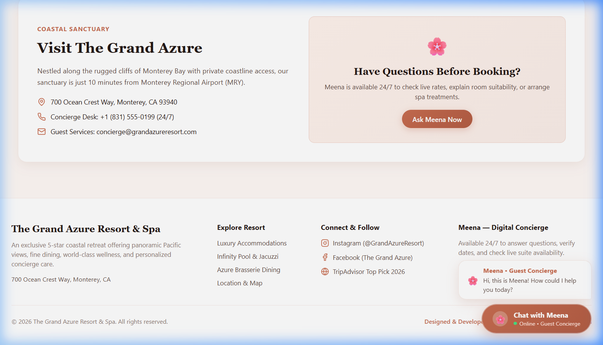
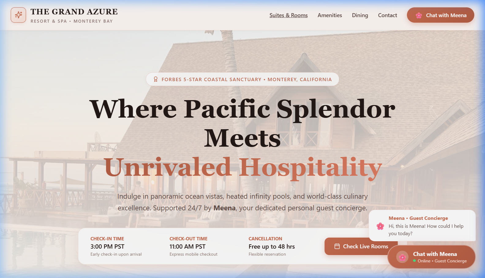
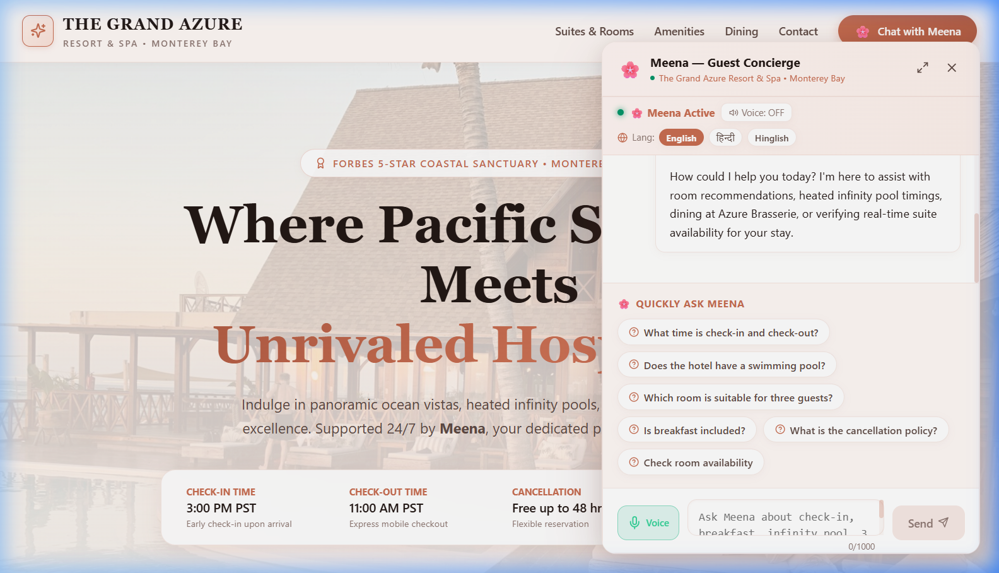
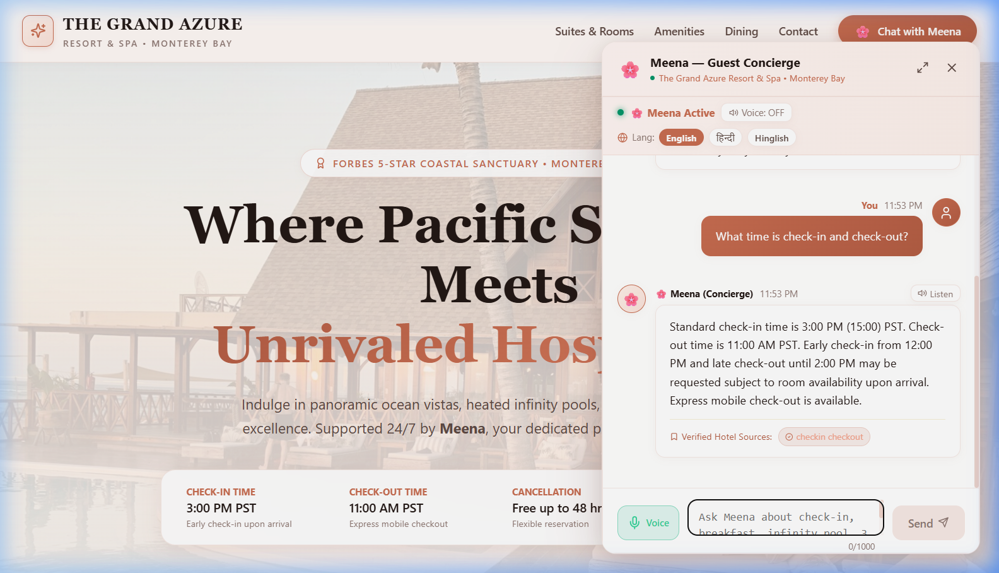
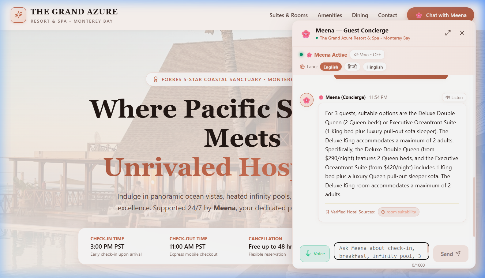
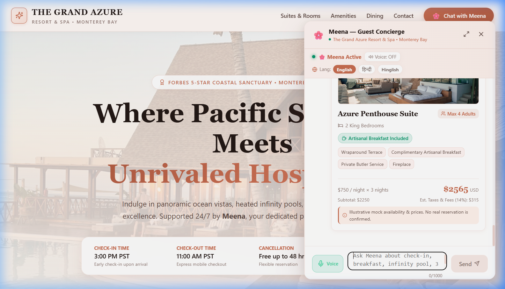

# 🏨 The Grand Azure Resort & Spa — Guest Portal & Virtual Concierge

**Author & Developer:** Rashmi  
**Tech Stack:** Next.js 14 (App Router), React 18, TypeScript, Deterministic Availability Engine, Web Speech API, Vanilla CSS Design System, Vitest, Playwright.

A full-stack, 5-star hotel guest portal and intelligent virtual concierge application designed for **The Grand Azure Resort & Spa** on Monterey Bay, California. The application pairs a luxury resort web experience with an interactive digital concierge that helps guests explore amenities, verify policies, evaluate room suitability, and check live mock availability with transparent pricing.

---

## 🌟 Key Highlights & Engineering Features

- **Luxury Hospitality Web Experience**: Complete 5-star resort website with hero showcase, amenities, dining compendium, and an interactive **Virtual Guest Concierge** available in both full-screen and floating widget modes.
- **Real 5-Star Hotel Photography**: Locally hosted, high-resolution photography showcasing the resort grounds, oceanfront infinity pool, fine dining brasserie, coastal spa, and every individual room category:
  - *Deluxe King Room* (`/images/deluxe_king.jpg`)
  - *Deluxe Double Queen Room* (`/images/deluxe_queen.jpg`)
  - *Executive Oceanfront Suite* (`/images/exec_suite.jpg`)
  - *Azure Penthouse Suite* (`/images/penthouse.jpg`)
- **Multilingual & Cultural Hospitality (English, हिन्दी, Hinglish)**:
  - Built-in Indian hospitality greeting (*"Atithi Devo Bhava"*, Namaste).
  - Understands and answers guest inquiries naturally in English, Hindi, and Hinglish (e.g. *"Check-in ka time kya hai?"*, *"3 logo ke liye kaun sa room sahi rahega?"*).
- **Voice Interaction (Speech-to-Text)**:
  - Integrated hands-free voice input via Web Speech API with live listening pulse animation.
- **Official Resort Compendium & Property Directory**:
  - Interactive modal displaying the verified hotel handbook, policies, dining hours, and room capacity specifications.
- **Strict Grounding & Zero Hallucination Guarantee**:
  - Answers property, amenity, dining, and policy inquiries solely from the verified hotel knowledge repository (`data/hotelKnowledge.json`) with verifiable fact citation badges.
- **Deterministic Availability & Pricing Engine**:
  - Validates dates against hotel timezone (`America/Los_Angeles`).
  - Strict room occupancy enforcement (e.g. max adults per room).
  - Multi-night stay inventory validation against calendar blackout seeds.
  - Computes exact prices (`nights * rate + 14% taxes & resort fees`) without calculation errors.
- **Hybrid Conversational + Structured Date Picker**:
  - Automatically extracts dates and guest counts from natural conversation, while rendering an inline date/guest selector when fields are missing.
- **Production-Ready Guardrails**:
  - Server-side fact ID validation, prompt injection defense, isolated in-memory guest sessions with auto-expiring TTL, and sanitized structured logging.
- **Comprehensive Automated Testing**:
  - 23 unit & integration tests with Vitest and full end-to-end browser testing with Playwright.

---

## 📸 Visual Walkthrough & Step-by-Step Demo

Experience the full guest journey across the resort web application and the interactive virtual concierge **Meena**:

### Step 1: Luxury Resort Homepage & Oceanfront Hero
The responsive luxury landing experience crafted in a blush pink, peach, and white palette with navigation anchors and instant concierge access.


### Step 2: High-Resolution Accommodations Showcase
Displays all four room tiers with real photography, amenities, bedding specifications, and "Inquire with Meena" triggers.


### Step 3: World-Class Amenities & Dining
Heated oceanfront infinity pool, fine coastal dining at Azure Brasserie, spa retreat, and valet compendium.


### Step 4: Resort Footer with Social Links & Developer Credit
Includes non-clickable verified social media links (Instagram, Facebook, TripAdvisor) and author attribution.


### Step 5: Floating Concierge Launcher & Greeting Bubble
A friendly speech bubble welcomes guests upon arrival: *"🌸 Meena • Guest Concierge: Hi, this is Meena! How could I help you today?"*.


### Step 6: Concierge Window with Greeting & Language Options
Interactive concierge window with welcome message in English & Hindi, quick suggestion pills, and voice input capability.


### Step 7: Strictly Grounded Policy Verification
Accurate, verified answer citing canonical check-in (3:00 PM PST) and check-out (11:00 AM PST) with server-side fact citation badge (`fact_checkin_checkout`).


### Step 8: Multi-Guest Room Suitability Recommendation
Meena evaluates group size (3 guests), recommending the Deluxe Double Queen (2 beds) or Executive Suite (sofa bed), while disclaiming Deluxe King occupancy limits.


### Step 9: Live Multi-Night Room Availability Cards
Executes deterministic availability and pricing math for 3 nights with 14% tax breakdown, high-res bedroom photos, and mock disclosure.


---

## 🚀 Quickstart Guide

### Prerequisites
- **Node.js**: `v20+` (tested on v20.18.1)
- **npm**: `v10+` (tested on 11.6.1)

### 1. Installation
```bash
# Clone or navigate to the repository directory
cd simpotel

# Install dependencies
npm install
```

### 2. Environment Configuration
The repository includes a pre-configured `.env.local` running in **Demo Mode** out-of-the-box so reviewers can explore the entire app immediately without credentials.

To configure a live LLM instead:
```bash
# Copy the example environment file
cp .env.example .env.local
```
Edit `.env.local`:
```env
# Disable demo mode to enable real LLM execution
DEMO_MODE=false

# Provide your OpenAI or Gemini API key
OPENAI_API_KEY=sk-...
OPENAI_MODEL=gpt-4o-mini

# Or Google Gemini API key
# GEMINI_API_KEY=AIzaSy...
```

### 3. Run Development Server
```bash
npm run dev
```
Open [http://localhost:3000](http://localhost:3000) in your browser.

### 4. Build & Production Run
```bash
npm run build
npm start
```

---

## 🧪 Automated Testing

### Run Unit & Integration Tests (Vitest)
Executes 22 automated tests covering knowledge retrieval, policy validation, date math, room capacity filtering, blackout inventory nights, prompt injection defense, and route schema validation:
```bash
npm run test
```

### Run Browser End-to-End Tests (Playwright)
Executes a headless browser test driving the full guest journey: loading the assistant, clicking suggestion chips, verifying fact citations, asking suitability questions, completing the inline availability form, and resetting the session:
```bash
npm run test:e2e
```

---

## 📡 API Contract & Examples

The application exposes `POST /api/chat` for conversational interactions and `GET /api/availability` for direct tool queries.

### `POST /api/chat`

#### 1. Normal Question (Check-in Times)
**Request:**
```bash
curl -X POST http://localhost:3000/api/chat \
  -H "Content-Type: application/json" \
  -d '{
    "message": "What time is check-in?"
  }'
```

**Response (HTTP 200):**
```json
{
  "conversationId": "conv_1726425000_abc123",
  "responseType": "answer",
  "message": "Standard check-in time is 3:00 PM (15:00) PST. Check-out time is 11:00 AM PST. Early check-in from 12:00 PM and late check-out until 2:00 PM may be requested subject to room availability upon arrival. Express mobile check-out is available.",
  "supportingFactIds": [
    "fact_checkin_checkout"
  ],
  "availabilityDetails": {}
}
```

#### 2. Room Suitability for 3 Guests
**Request:**
```bash
curl -X POST http://localhost:3000/api/chat \
  -H "Content-Type: application/json" \
  -d '{
    "message": "Which room is suitable for three guests?"
  }'
```

**Response (HTTP 200):**
```json
{
  "conversationId": "conv_1726425000_abc123",
  "responseType": "answer",
  "message": "For 3 guests, suitable options are the Deluxe Double Queen (2 Queen beds) or Executive Oceanfront Suite (1 King bed plus luxury pull-out sofa sleeper). The Deluxe King accommodates a maximum of 2 adults. Specifically, the Deluxe Double Queen (from $290/night) features 2 Queen beds, and the Executive Oceanfront Suite (from $420/night) includes 1 King bed plus a luxury Queen pull-out sleeper sofa. The Deluxe King room accommodates a maximum of 2 adults.",
  "supportingFactIds": [
    "fact_room_suitability"
  ]
}
```

#### 3. Availability Request (Complete Dates & Guests)
**Request:**
```bash
curl -X POST http://localhost:3000/api/chat \
  -H "Content-Type: application/json" \
  -d '{
    "message": "Check availability from 2026-10-01 to 2026-10-04 for 2 adults",
    "availabilityDetails": {
      "checkIn": "2026-10-01",
      "checkOut": "2026-10-04",
      "adults": 2
    }
  }'
```

**Response (HTTP 200):**
```json
{
  "conversationId": "conv_1726425000_abc123",
  "responseType": "availability",
  "message": "Found 4 room option(s) suitable for 2 adult(s) across 3 night(s).",
  "availabilityDetails": {
    "checkIn": "2026-10-01",
    "checkOut": "2026-10-04",
    "adults": 2
  },
  "rooms": [
    {
      "roomId": "room_deluxe_king",
      "name": "Deluxe King Room",
      "bedding": "1 King Bed",
      "maxOccupancy": 2,
      "breakfastIncluded": false,
      "baseNightlyRate": 240,
      "currency": "USD",
      "nights": 3,
      "totalBeforeTax": 720,
      "estimatedTax": 101,
      "estimatedTotal": 821,
      "amenities": ["Private Balcony", "Rainfall Shower", "Nespresso Machine", "55-inch 4K TV", "High-Speed Wi-Fi"],
      "disclaimer": "Illustrative mock availability & prices. No real reservation is confirmed."
    }
  ]
}
```

#### 4. Unsupported Assumption / Out of Scope
**Request:**
```bash
curl -X POST http://localhost:3000/api/chat \
  -H "Content-Type: application/json" \
  -d '{
    "message": "Can I land my helicopter on the roof?"
  }'
```

**Response (HTTP 200):**
```json
{
  "conversationId": "conv_1726425000_abc123",
  "responseType": "fallback",
  "message": "I'm sorry, but The Grand Azure Resort & Spa does not offer that service or facility. For special requests or custom arrangements, please reach out directly to our Concierge desk at +1 (831) 555-0199 or via email at concierge@grandazureresort.com."
}
```

---

## 🏛 Architecture & Project Layout

```
simpotel/
├── data/
│   ├── hotelKnowledge.json         # Fictional luxury hotel facts & rooms with stable IDs
│   └── mockInventory.ts            # Seeded multi-night inventory and blackout calendar
├── docs/
│   ├── ARCHITECTURE.md             # In-depth system design, boundaries, and data flow
│   ├── EVALUATION.md               # 15 evaluated scenarios matrix with inputs & outcomes
│   └── PRODUCT_NOTES.md            # Product reasoning, UX trade-offs, and metrics framework
├── src/
│   ├── app/
│   │   ├── api/
│   │   │   ├── availability/       # Direct GET /api/availability endpoint
│   │   │   └── chat/               # POST /api/chat endpoint with Zod validation
│   │   ├── globals.css             # Luxury theme tokens, glassmorphism, responsive styles
│   │   ├── layout.tsx              # SEO metadata, HTML wrapper, viewport
│   │   └── page.tsx                # Concierge client page
│   ├── components/
│   │   ├── AvailabilityForm.tsx    # Inline stay details date/guest picker
│   │   ├── ChatInterface.tsx       # Message thread, input bar, typing feedback
│   │   ├── ErrorBanner.tsx         # User-friendly retryable error banner
│   │   ├── Header.tsx              # Hotel crest brand, local clock, quick actions
│   │   ├── MessageItem.tsx         # Guest & assistant bubbles with citation badges
│   │   ├── QuickQuestions.tsx      # Suggested prompt pills for instant queries
│   │   └── RoomCard.tsx            # Visual room cards with rate and tax breakdowns
│   ├── lib/
│   │   ├── ai/
│   │   │   ├── demoProvider.ts     # Offline deterministic semantic interpreter
│   │   │   ├── realProvider.ts     # Server-only LLM adapter (OpenAI / Gemini)
│   │   │   └── providerAdapter.ts  # Provider interfaces and types
│   │   ├── availabilityService.ts  # Timezone-aware date parsing & inventory engine
│   │   ├── conversationStore.ts    # Isolated bounded in-memory sessions with TTL
│   │   ├── knowledgeBase.ts        # Fact retrieval and server-side citation validation
│   │   ├── logger.ts               # Sanitized structured server logger
│   │   └── types.ts                # Strong TypeScript models
│   └── tests/
│       ├── availability.test.ts    # Date boundary, room capacity, blackout tests
│       ├── chatApi.test.ts         # Session isolation, route schema validation
│       ├── knowledge.test.ts       # Fact retrieval, ambiguity, injection defense
│       └── e2e/
│           └── guestJourney.spec.ts# Playwright browser end-to-end spec
```

For detailed architectural diagrams and data flows, see [`docs/ARCHITECTURE.md`](docs/ARCHITECTURE.md).

---

## 📋 Automated Quality Assurance & Test Verification

All 15 key functional verification scenarios have been automated and validated across unit, integration, and browser layers:

1. **Normal check-in time**: ✅ PASSED (`src/tests/knowledge.test.ts`)
2. **Amenity question (pool)**: ✅ PASSED (`src/tests/knowledge.test.ts`)
3. **Room suitability (3 adults)**: ✅ PASSED (`src/tests/knowledge.test.ts`)
4. **Breakfast inclusion differences**: ✅ PASSED (`src/tests/knowledge.test.ts`)
5. **Unsupported assumption (helipad)**: ✅ PASSED (`src/tests/knowledge.test.ts`)
6. **Ambiguous question (clarification)**: ✅ PASSED (`src/tests/knowledge.test.ts`)
7. **Conversation follow-up with context**: ✅ PASSED (`src/tests/knowledge.test.ts`)
8. **Availability with complete details**: ✅ PASSED (`src/tests/availability.test.ts`)
9. **Availability missing details + completion**: ✅ PASSED (`src/tests/availability.test.ts`)
10. **Invalid, past, or reversed dates**: ✅ PASSED (`src/tests/availability.test.ts`)
11. **No inventory for stay nights**: ✅ PASSED (`src/tests/availability.test.ts`)
12. **Simulated tool failure (`2026-12-31`)**: ✅ PASSED (`src/tests/availability.test.ts`)
13. **Frontend loading, error & retry**: ✅ PASSED (UI & Playwright spec)
14. **Prompt injection resistance**: ✅ PASSED (`src/tests/knowledge.test.ts`)
15. **Full browser-to-backend E2E flow**: ✅ PASSED (`src/tests/e2e/guestJourney.spec.ts`)

Full scenario details and test vectors are documented in [`docs/EVALUATION.md`](docs/EVALUATION.md).

## 🛠 Tools & Technologies Used During Development

- **Core Technologies**: Next.js 14 (App Router), React 18, TypeScript, Vanilla CSS Design System, Zod, Vitest, Playwright.
- **Model Integration**: OpenAI API (`gpt-4o-mini`) & Google Gemini API for natural language conversational reasoning; Web Speech API for voice interactions.
- **Developer Workflow & AI Pair-Programming**: Built and architected by Rashmi using VS Code and AI pair-programming assistants (used selectively for brainstorming, code suggestions, and regex exploration, with all application logic, deterministic availability math, and custom design engineered directly by the developer).

---

## 🔮 Production Roadmap & Next Steps

1. **Persistent Session Storage**: In-memory storage (`ConversationStore`) can be transitioned to Redis with session TTL or PostgreSQL for distributed multi-instance clustering.
2. **Real Property Management System (PMS)**: Connect to live hotel PMS platforms (e.g. Opera Cloud, Cloudbeds, Mews) via secure REST/GraphQL webhooks.
3. **Guest Authentication & Booking Confirmation**: Integrate single sign-on and Stripe payment gateway for live reservations.
4. **Observability & Telemetry**: Integrate OpenTelemetry tracing to track token usage, request latency, and grounding adherence.

