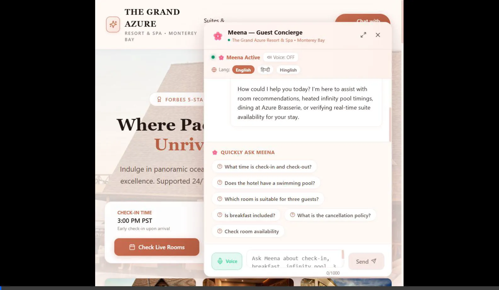

# Visual Walkthrough: The Grand Azure Resort & Spa

**Developer:** Rashmi  
**Application:** Hotel Guest Portal & Virtual Concierge ("Meena")  
**🌐 Live Deployed URL:** [https://simpotel-two.vercel.app](https://simpotel-two.vercel.app)  

This document details the step-by-step visual experience of the web application, showcasing the resort interface, the embedded virtual concierge, and the deterministic availability engine in action.

---

## 📹 Full Video Walkthrough

The following recording demonstrates the complete end-to-end guest journey:

- **Direct File Link:** [docs/media/demo_walkthrough.webp](media/demo_walkthrough.webp) *(Full 8.1MB video)*
- **Live Interactive Demo:** [https://simpotel-two.vercel.app](https://simpotel-two.vercel.app)

---

## 📸 Step-by-Step Visual Gallery

### Step 1: Luxury Resort Homepage & Hero Section
- **Location:** `http://localhost:3000/`
- **Features:** High-resolution oceanfront hero background, Forbes 5-Star luxury badge, brand crest, sticky navigation bar with section anchors, and call-to-action buttons.
- **Palette:** Warm ivory peach (`#fff9f6`), blush pink gradients, and terracotta rose-gold accents.

---

### Step 2: Accommodations & Suite Showcase
- **Location:** `#rooms`
- **Features:** Real photography for each room category (Deluxe King, Deluxe Double Queen, Executive Oceanfront Suite, and Azure Penthouse Suite) with pricing, bedding specs, and "Inquire with Meena" buttons.

---

### Step 3: Resort Amenities & Dining Compendium
- **Location:** `#amenities` and `#dining`
- **Features:** Real photography and operational compendium for the heated saline infinity pool, oceanfront jacuzzi, Azure Brasserie dining, Serenity Coastal Spa, and valet services.

---

### Step 4: Resort Footer & Social Media Channels
- **Location:** `#contact` & footer
- **Features:** 24/7 concierge contact information, verified social links for Instagram (`@GrandAzureResort`), Facebook (`The Grand Azure`), and TripAdvisor (`Top Pick 2026`), and developer credit for Rashmi.

---

### Step 5: Floating Concierge Launcher & Greeting Bubble
- **Features:** Unobtrusive floating launcher at the bottom-right corner with a friendly welcoming speech bubble:
  > *"🌸 **Meena • Guest Concierge**: Hi, this is Meena! How could I help you today?"*

---

### Step 6: Virtual Concierge "Meena" Window
- **Features:** Embedded concierge chat window with welcome message in English & Hindi, quick starter question chips, language toggle, and speech recognition voice input.

---

### Step 7: Grounded Policy Verification with Source Badges
- **Question:** *"What time is check-in?"*
- **Response:** Grounded answer citing 3:00 PM check-in and 11:00 AM check-out with verified citation badge (`fact_checkin_checkout`).

---

### Step 8: Multi-Guest Room Suitability Recommendation
- **Question:** *"Which room is suitable for three guests?"*
- **Response:** Meena evaluates room capacities and recommends the Deluxe Double Queen (2 queen beds) and Executive Oceanfront Suite (pull-out sofa), while noting the Deluxe King is capped at 2 adults.

---

### Step 9: Live Multi-Night Room Availability Cards
- **Search:** *"Check availability from 2026-10-01 to 2026-10-04 for 2 adults"*
- **Result:** Live availability cards with bedroom photo previews, base nightly rates, subtotal (₹54,000), transparent 18% GST calculation (₹9,720), total cost (₹63,720), and mock disclaimer.

